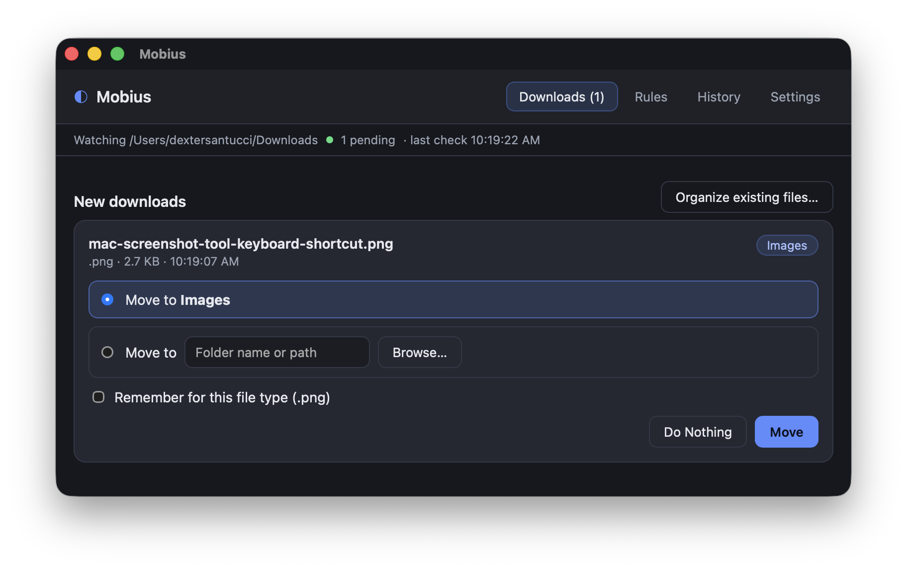
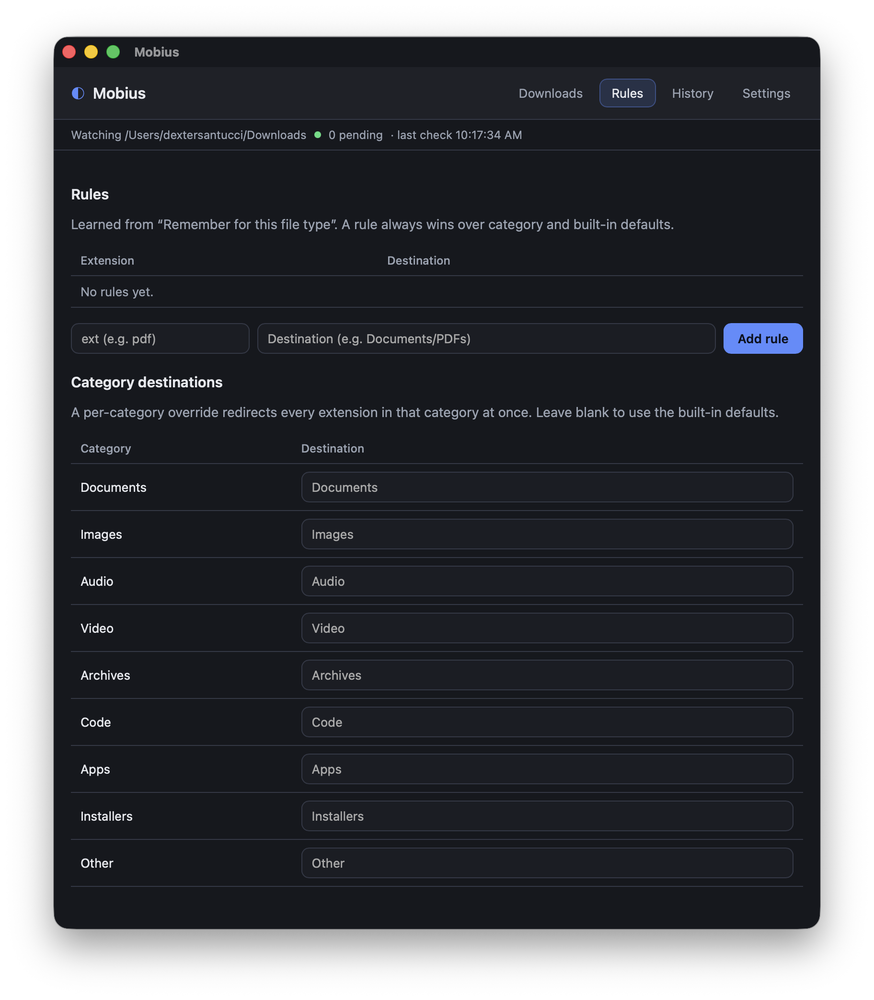
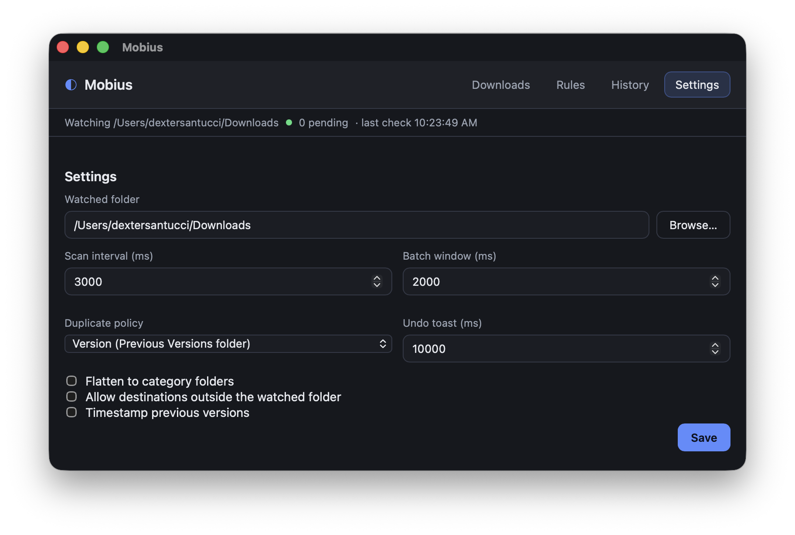

# Project Mobius

Mobius is a cross-platform desktop app that watches your Downloads folder,
detects newly completed files, and asks how you'd like to organize them. Move
files to sensible category folders, remember rules for the types you care about,
review and organize what's already in Downloads, and undo anything with a click.
It lives in the system tray, so it can keep working quietly in the background.

It is local-only: no network, no telemetry, no accounts. Mobius never deletes
your files.







## Features

- **Real-time monitoring** — native filesystem events (via `notify`), debounced
  so bursts of writes collapse into one check, plus a periodic reconciliation
  scan as a fallback. A readiness gate waits for a file's size to stop changing
  before it enters the queue.
- **Extension classification** — files map to destinations such as
  `Documents/PDFs`, `Documents/Word Files`, `Images`, and `Apps` for disk images
  and macOS bundles.
- **Confirmation dialog** — move to the suggested folder, choose a custom folder,
  remember a rule for that file type, or do nothing. Batch downloads can be
  applied all at once.
- **Organize existing files** — review everything already in Downloads, edit the
  destination per file (or per file type), and move the ones you pick.
- **Duplicate versioning** — conflicting files move to a `Previous Versions/`
  subfolder instead of being overwritten.
- **Rules manager & overrides** — inspect learned rules and tune destinations by
  extension or whole category.
- **System tray** — a menu with Open, Pause (30 min / 1 h / 3 h / until resumed),
  Resume, Recent moves, Settings, and Quit.
- **Close to tray** — closing the window hides Mobius instead of quitting, so it
  keeps running in the background.
- **Native About menu** — an About item crediting the author.
- **History & undo** — reverse recent moves from a toast or the history panel.

### Planned

- Archive extraction — an `Extract to …` option for `.zip`/`.tar`/`.tar.gz`.
- Launch at login.

## Tech stack

Rust + [Tauri](https://tauri.app) v2, with a React + TypeScript + Vite frontend.

## Documentation

Full specifications live in [SPECS.md](./SPECS.md).

## Development

Prerequisites: Rust, Node.js, and the platform dependencies required by Tauri.

```sh
npm install
npm run tauri dev      # run in development
npm run tauri build    # produce a local bundle
```

Cross-platform release builds (macOS Apple Silicon, Windows x64, and Linux x64)
are produced by the workflow in
[`.github/workflows/release.yml`](./.github/workflows/release.yml) when a `v*` tag
is pushed.

## Status

v0.1.4 enables **real-time filesystem watching** (native OS events, debounced),
with the periodic timed scan kept as a fallback and reconciliation pass. This
builds on v0.1.3 (system tray, pause/snooze, close-to-tray), v0.1.2 (Linux builds),
v0.1.1 (native About menu and the "Organize existing files" dialog), and v0.1.0,
the first functional build.

Downloads for macOS (Apple Silicon), Windows (x64), and Linux (x64, `.deb` +
AppImage) are attached to the [releases](https://github.com/DexterLagan/Mobius/releases).

## Version history

### v0.1.4
- Enabled real-time filesystem watching using native OS events (`notify`),
  debounced (default 750 ms) so bursts of writes collapse into a single check.
- The periodic timed scan is kept as a fallback and reconciliation pass, so
  detection still works if the watcher is unavailable.
- Reworked the readiness gate to be time-based: a file is promoted once its size
  has been stable for 1.5 s, which works with both event-driven and timed checks.
- The watcher follows the configured watch folder and re-attaches when it changes.

### v0.1.3
- Added a system tray icon with a menu: **Open**, **Pause** (30 min / 1 h / 3 h /
  until resumed), **Resume**, **Recent moves**, **Settings**, and **Quit**.
- Closing the window now hides Mobius to the tray; quit explicitly from the tray
  or the application menu.
- The status bar indicates when monitoring is paused.

### v0.1.2
- Added Linux (x64) release builds: `.deb` and `.AppImage`.
- Verified Linux support in CI: builds and unit tests pass on Ubuntu 22.04.
- Downloads folder resolution on Linux uses the XDG user dirs
  (`XDG_DOWNLOAD_DIR`), falling back to `$HOME/Downloads`.

### v0.1.1
- Added a native **About Mobius** application-menu item — the macOS system About
  panel, or a native message dialog on Windows/Linux — crediting Dexter Santucci.
- Added the **Organize existing files** dialog: lists everything already in
  Downloads alongside its destination, with per-file selection and inline
  destination editing. An **Apply to all .ext files** checkbox persists the change
  as a rule.
- Fixed a Windows-only build error in the application menu setup.

### v0.1.0
- First functional release.
- Timed (periodic) Downloads scan with a size-stability readiness gate.
- Extension-based classification into `Documents/PDFs`, `Documents/Word Files`,
  `Images`, `Apps`, and more.
- Confirmation queue with suggested/custom destinations, "apply to all current
  downloads", and "remember for this file type".
- Duplicate versioning into a `Previous Versions/` subfolder.
- Rules manager, per-category destination overrides, and history with undo.
- Real-time filesystem watcher intentionally not enabled yet.

## License

MIT — see [LICENSE](./LICENSE).
